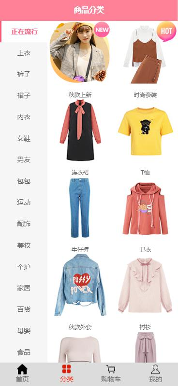
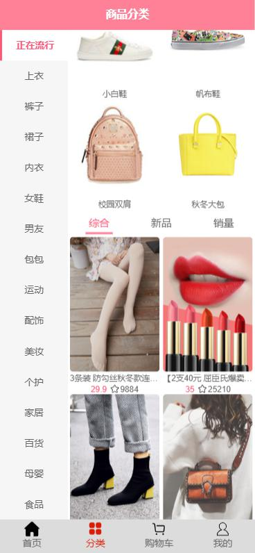
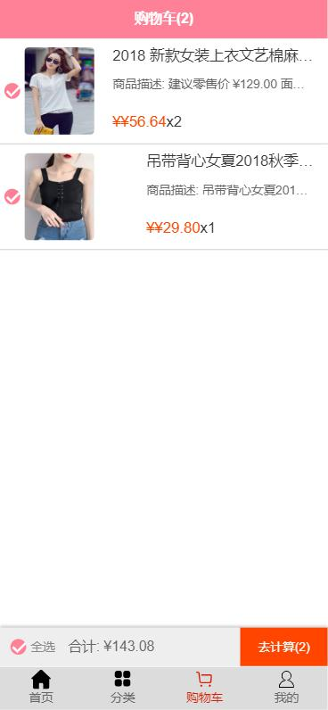
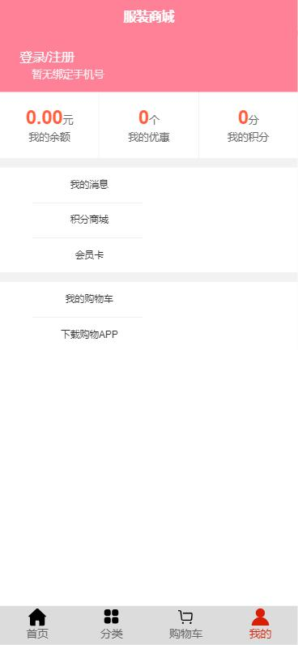

       服装商城系统
       
主要使用vue框架进行编写，主要的插件有Bscroll（解决移动端滑动的问题），vue-lazyload（用于图片的懒加载），
axios（用于获取后台数据）

该系统为SPA，主要由首页，详情页，分类，购物车，用户五个页面组成。
1.首页截图：
首页中包含了导航栏，轮播图，商品推荐等模块，最下方的导航栏使用了前端路由，点击商品推荐中的图片会跳转到详情页。

2.详情页截图：
详情页包含了商品展示的轮播图和其它一些详细信息，商品的参数，评论，推荐等，点击顶部导航栏中的按钮会跳到相应的位置。

3.分类页截图：
商品分类页中包含了左侧的菜单栏，右边则是商品的具体分类和商品推荐。

4.购物车页面截图：
在商品详情页点击加入购物车后的商品将会出现在购物车页面，这个页面主要是负责展示，计算用户购买的商品价格。

5.用户信息页面截图：
用户信息页面展示了用户的相关信息


# clothes_shop
# 
## Project setup
```
npm install
```

### Compiles and hot-reloads for development
```
npm run serve
```

### Compiles and minifies for production
```
npm run build
```

### Lints and fixes files
```
npm run lint
```

### Customize configuration
See [Configuration Reference](https://cli.vuejs.org/config/).


